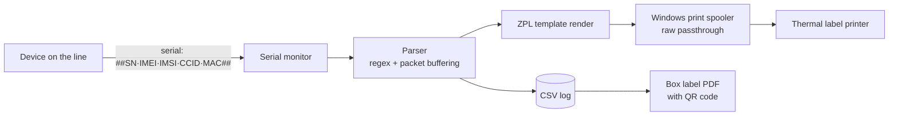

# Thermal Label Printer Automation

A Windows desktop application that listens to a serial port, parses device identity data as it arrives, and prints a barcode/QR label on a thermal printer — automatically, in under a second, with every unit logged to CSV.

Built for a production line where each assembled device reports its own identifiers over serial the moment it powers up. Instead of an operator reading numbers off a screen and typing them into a label designer, the device announces itself and the label comes out of the printer.

> **Note:** This started as an internal tool for a specific production line and has since been generalised — the serial number prefix, counter, printer names, COM ports and parsing pattern all live in [`config.json`](config.json), and the label layout is a plain ZPL template you can edit from inside the app.

<!-- TODO: add screenshots here, e.g.


-->

## What it does



- **Serial monitoring** — watches a COM port, buffers partial packets and tolerates stray control characters in the stream.
- **Field parsing** — a configurable regex pulls serial number, IMEI, IMSI, CCID and MAC out of each packet.
- **ZPL label printing** — renders a template and sends raw ZPL straight to the Windows print spooler, so nothing is rasterised and printing stays fast.
- **Two printing modes** — *auto* prints on arrival; *queue* holds each unit for operator confirmation and lets the tracking counter be edited first.
- **Auto-incrementing counter** — every unit gets a sequential tracking number, resumed from the CSV history on restart so a crash doesn't reset the sequence.
- **Dual printer support** — an optional second printer (e.g. a small board-level label printer that speaks TSPL rather than ZPL) can print simultaneously.
- **CSV logging** — every unit, success or parse error, with timestamp and raw packet for traceability.
- **Box labels** — collect N devices into a shipping box label as a PDF with a QR code, generated with ReportLab.
- **Template editor** — edit the ZPL layout inside the app and test it against sample data without touching code.
- **Standalone executable** — packaged with PyInstaller so line operators do not need Python installed.

## Requirements

- Windows 10/11 (the print path uses the Windows spooler via `pywin32`)
- Python 3.9+ (only to run from source)
- A thermal label printer that accepts raw ZPL, connected via USB with its Windows driver installed
- A serial data source (USB-to-serial adapter, microcontroller, test fixture, …)

## Installation

```bash
git clone https://github.com/talhaid/thermal-label-printer.git
cd thermal-label-printer
pip install -r requirements.txt
python printer_gui.py
```

Or double-click `run_gui.bat`, which checks the dependencies first.

**Prefer not to install Python?** Download the packaged `.exe` from the [Releases](../../releases) page and run it directly.

## Configuration

All deployment-specific values live in [`config.json`](config.json). Every key is optional — anything missing falls back to the defaults in [`config.py`](config.py), so the app runs without a config file.

| Key | What it does | Default |
|---|---|---|
| `serial_prefix` | Prefix printed in front of the serial number (and stripped from incoming data). Leave empty if your serials carry their own. | `""` |
| `counter_start` | Value the sequential tracking counter (`STC`) starts from on a fresh log. | `60000` |
| `printer_keywords` | Case-insensitive substrings matched against Windows printer names to auto-select the label printer. | `["zebra", "gc420", "zdesigner", "thermal", "label"]` |
| `secondary_printer_keywords` | Same, for the optional second (board) printer. | `["xprinter", "tsc", "pcb", "controller"]` |
| `preferred_ports` | COM ports tried in order before falling back to the first one found. | `["COM7", "COM4", "COM3"]` |
| `baudrate` | Serial baud rate. | `115200` |
| `parse_pattern` | Regex applied to the incoming stream. Capture groups map to serial number, IMEI, IMSI, CCID, MAC in that order. | see file |

### Expected data format

```
##SERIAL_NUMBER|IMEI|IMSI|CCID|MAC_ADDRESS##
```

For example:

```
##DEV000000000001|123456789012345|286010000000000|8990000000000000000|AA:BB:CC:DD:EE:FF##
```

Different format? Change `parse_pattern` in `config.json` (or from the app's Settings tab) — the field order stays the same, the delimiters and character classes are yours.

## Label template

The layout is plain ZPL in [`templates/device_label_template.zpl`](templates/device_label_template.zpl), editable from the app's *ZPL Template* tab. Available placeholders:

`{STC}` · `{SERIAL_PREFIX}` · `{SERIAL_NUMBER}` · `{IMEI}` · `{IMSI}` · `{CCID}` · `{MAC_ADDRESS}`

The default template is a 50 × 30 mm label at 203 DPI: a QR code carrying all fields on the left, human-readable text on the right.

## Interface

| Tab | Purpose |
|---|---|
| **Main Control** | Printer/port selection, counter, auto vs. queue mode, live status and statistics |
| **Box Labels** | Group devices into a box, edit the table, generate the box label PDF |
| **CSV Manager** | Browse the log, filter and export, clean duplicates, view statistics |
| **ZPL Template** | Edit the label layout and test it against sample data |
| **Logs** | Live application log, saveable to file |
| **Settings** | Parsing pattern, field mapping, print preferences |

## Project structure

```
├── printer_gui.py                # Tkinter GUI, all tabs and workflows
├── serial_auto_printer.py        # Serial monitoring, parsing, template rendering, CSV logging
├── zpl_printer.py                # ZPL/TSPL command generation and raw spooler printing
├── pdf_printer.py                # PDF → raster → printer path (for pre-made PDF labels)
├── config.py / config.json       # Configuration layer with built-in defaults
├── build_gui_exe.py              # PyInstaller packaging script
├── run_gui.bat                   # Dependency check + launcher
├── templates/                    # ZPL label templates
└── save/                         # Generated output (CSV logs, ZPL dumps, box label PDFs)
```

## Building the executable

```bash
pip install pyinstaller
python build_gui_exe.py
```

Produces a single-file `dist/ThermalPrinterGUI.exe` with the template and config bundled. The build output is deliberately not committed — the executable belongs on the Releases page, not in git history.

## Tested hardware

Developed and run in production against a **Zebra GC420T** (203 DPI, ZPL) for device labels and an **XPrinter XP-470B** (TSPL) for small board labels. Any printer whose Windows driver accepts raw ZPL passthrough should work — add a matching substring to `printer_keywords`.

## Troubleshooting

| Symptom | Fix |
|---|---|
| Printer not listed | Confirm it appears under Windows *Devices and Printers*; reinstall the vendor driver |
| Printer not auto-selected | Add a substring of its Windows name to `printer_keywords` in `config.json` |
| `win32print not available` | `pip install pywin32` |
| Serial port busy | Another application (a terminal, the vendor tool) is holding the port — close it |
| Parse errors in the log | Compare an incoming packet against `parse_pattern`; the Logs tab shows the raw data |
| Label prints blank or garbled | The driver is rasterising instead of passing ZPL through — enable passthrough, or use the ZPL/"generic text" driver variant |

## Notes on scope

This is a single-purpose production tool rather than a library. The GUI module is large and carries most of the workflow logic; splitting it further, adding tests around the parser, and replacing the remaining `print()` calls with structured logging are the obvious next steps and are not done yet.

## License

[MIT](LICENSE)
